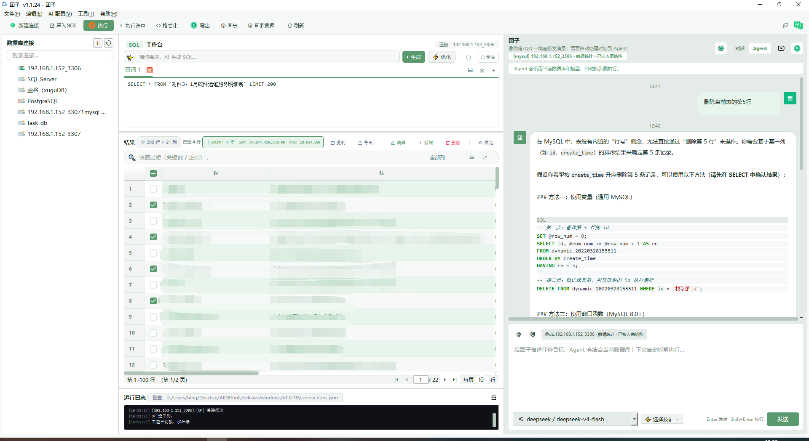
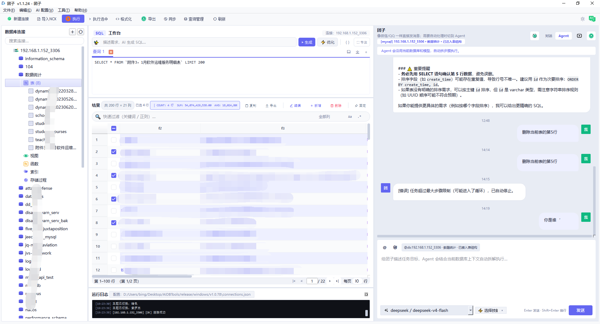

<div align="center">


# 团子 (AIDBTools)

**新一代 AI 驱动的数据库管理工具**

支持 MySQL、PostgreSQL、SQL Server、Oracle、达梦、人大金仓、虚谷、星环等多种数据库  
内置 AI SQL 生成、AI 对话助手、跨库数据同步、定时任务调度

[](LICENSE)
[](https://python.org)
[](https://doc.qt.io/qtforpython/)
[](#%E5%B9%B3%E5%8F%B0%E6%94%AF%E6%8C%81)
[](CHANGELOG.md)
[](https://github.com/shihuibing/AIDBTools)

[快速开始](#快速开始) · [功能特性](#功能特性) · [数据库支持](#数据库支持) · [截图](#截图) · [开发计划](#开发计划) · [贡献](#贡献)

</div>

---

## 简介

**团子**（AIDBTools）是一款面向开发、运维与数据分析场景的桌面数据库管理工具，基于 **PySide6** 构建，深度集成 AI 大模型能力。

- 用自然语言描述需求，AI 自动生成 SQL
- 内嵌 AI 对话助手，随时问随时答
- 支持十余种主流及国产数据库
- 跨平台：Windows、Linux、银河麒麟（ARM/x86）、统信 UOS、Deepin

---

## 功能特性

### 数据库管理
- 多数据库连接管理（树形结构浏览表/视图/存储过程）
- SQL 工作台：多 Tab 并行编辑，语法高亮，执行历史
- 结果表格：分页浏览、行内编辑、多格式导出（CSV / Excel / JSON）
- 数据导入：支持 CSV / Excel / JSON 批量导入
- Navicat `.ncx` 连接文件一键批量导入

### AI 能力
- **AI SQL 生成**：自然语言 → SQL，自动适配目标数据库方言
- **AI SQL 优化**：粘贴慢 SQL，AI 给出优化建议
- **AI 对话助手**：右侧面板嵌入，支持多轮对话
- **Skill 管理**：可导入自定义 Skill 扩展 AI 能力
- 多大模型支持：DeepSeek、OpenAI 兼容、Anthropic、Ollama、LiteLLM 等

### 数据操作
- **数据同步**：表级 / 库级跨连接数据同步
- **数据库备份与恢复**：全量 / 增量备份，支持定时自动备份
- **定时任务调度**：可视化配置，支持 Cron 表达式

### 界面体验
- 三套主题：亮色（Violet）、暗色（Dark）、柳绿（Willow Green）
- RemixIcon 图标体系
- 无边框对话框风格
- 键盘快捷键支持（[查看快捷键列表](KEYBOARD_SHORTCUTS.md)）

---

## 数据库支持

| 类型 | 数据库 |
|------|--------|
| **主流关系型** | MySQL 5.7+ / 8.x、PostgreSQL 12+、SQL Server 2016+、Oracle 12c+ |
| **国产数据库** | 达梦（DM8）、人大金仓（KingbaseES V8/R6）、高斯（GaussDB / openGauss）、虚谷（XuguDB）、神通 |
| **分布式 / 云** | OceanBase、PolarDB、TDSQL、GBase、TiDB |
| **大数据** | 星环科技 ArgoDB / Inceptor（JDBC + ODBC 双模式，自动探测驱动） |

---

## 截图

### SQL 工作台 + AI 对话助手

<div align="center">
  
  <p><sub>SQL 工作台 + AI 对话助手（Willow Green 主题）</sub></p>
</div>

### 数据库树形浏览 + AI Agent 交互

<div align="center">
  
  <p><sub>数据库树形浏览 + AI Agent 自动执行模式（Violet 主题）</sub></p>
</div>

---

## 下载即用（Windows）

无需安装 Python，直接下载运行：

| 版本 | 下载地址 | 大小 |
|------|---------|------|
| v1.1.25（最新版） | [👈 点击下载 AIDBTools_v1.1.25_windows.exe](https://github.com/shihuibing/AIDBTools/releases/download/v1.1.25/AIDBTools_v1.1.25_windows.exe) | 149MB |

> exe 文件通过 **GitHub Releases** 分发，直接点击上方链接即可下载

---

## 平台支持

| 平台 | 安装方式 | 说明 |
|------|---------|------|
| Windows 10/11 | [直接下载 exe](https://github.com/shihuibing/AIDBTools/releases/download/v1.1.25/AIDBTools_v1.1.25_windows.exe) / 源码运行 | 149MB，无需安装，双击即用 |
| Linux x86_64 | 源码运行 / `build_linux.sh` 打包 | Ubuntu 20.04+、CentOS 7+ |
| 银河麒麟 V10 ARM | `install_kylin.sh` | aarch64，已测试 |
| 银河麒麟 V10 x86 | `build_kylin_x86.sh` | 含离线包构建方式 |
| 统信 UOS / Deepin | 源码运行 | 参考 Linux 安装方式 |

---

## 快速开始

### 环境要求

- Python 3.9 – 3.12（推荐 3.11）
- pip 23+

### 安装依赖

```bash
# 克隆仓库
git clone https://github.com/shihuibing/AIDBTools.git
cd AIDBTools

# 安装依赖（Windows）
pip install -r requirements.txt

# 安装依赖（Linux / 国产系统）
pip install -r requirements_linux.txt
```

> **国产系统离线安装**：参考 [OFFLINE_DEPLOY_GUIDE.md](OFFLINE_DEPLOY_GUIDE.md)

### 启动

```bash
python main.py
```

### 配置 AI 大模型

首次启动后，在「设置 → 大模型配置」中填入你的 API Key，或在菜单栏点击大模型配置图标。

支持的 API 格式：
- DeepSeek API（推荐，兼容 OpenAI 格式）
- OpenAI / 任意兼容 OpenAI 格式的接口
- Anthropic
- Ollama（本地部署）
- LiteLLM 代理

---

## 打包发布

```bash
# Windows
build_windows.bat

# Linux
bash build_linux.sh

# 银河麒麟 ARM
bash build_arm_kylin.sh

# 银河麒麟 x86
bash build_kylin_x86.sh
```

打包产物输出至 `dist/` 目录。详细说明见 [QUICK_START_BUILD.md](QUICK_START_BUILD.md)。

---

## 开发计划

- [ ] 数据 ER 图可视化
- [ ] 更多国产数据库驱动内置支持
- [ ] 查询结果图表化（柱状图 / 折线图）
- [ ] 多语言国际化（英文 UI）
- [ ] 插件市场

---

## 贡献

欢迎提交 Issue 和 Pull Request！

1. Fork 本仓库
2. 创建你的特性分支：`git checkout -b feature/my-feature`
3. 提交更改：`git commit -m 'feat: 添加 xxx 功能'`
4. 推送分支：`git push origin feature/my-feature`
5. 发起 Pull Request

**提 Bug 时请附上：**
- 操作系统 + Python 版本
- 数据库类型和版本
- 错误截图或日志（日志在程序根目录 `*.log` 文件）

---

## 许可证

本项目采用 [Apache License 2.0](LICENSE) 开源许可证。

```
Copyright 2026 石慧兵 <1795794877@qq.com>

Licensed under the Apache License, Version 2.0
```

---

<div align="center">
  <sub>用 ❤️ 和 AI 打造 · 欢迎 Star ⭐</sub>
</div>
